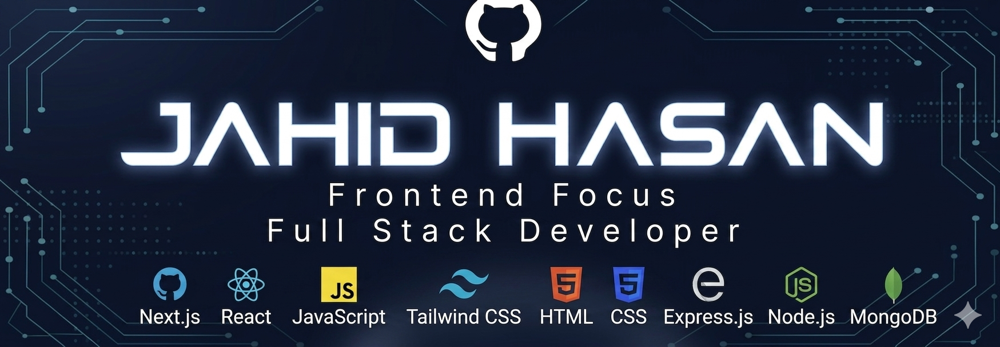

  

<h1 align="center">
  
</h1>

<h1 align="center">Frontend-focused full-stack developer | JavaScript, React.js, Next.js,Node js,Express,MongoDB,Better Auth, Tailwind CSS</h1>

                                                                                                                       

  
             

                                                                                                                                                                                                                                 

<table align="center">

  
<tr>
<td>

### Talking about Personal Stuff:

🔧 I’m currently working with Javascript, React ,Next.js ,Node js ,Express ,MongoDB , Tailwind CSS.  

🚀 I’m currently exploring nodejs,express.  

📫 Reach me out: jjjjahidhasan999@gmail.com  

💻 I love exploring new technologies and building cool stuff.

</td>

<td>

</td>
</tr>
</table>

  

  ### 

      

