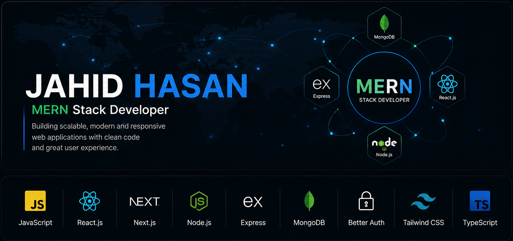

  

<h1 align="center">Hi 👋, I'm Jahid Hasan</h1>

<h3 align="center">
  
</h3>

<h2 align="center">🚀 About Me</h2>

A growth-oriented <strong>MERN Stack Developer</strong> dedicated to building scalable, secure, and user-centric web applications.

Experienced in <strong>JavaScript, React.js, Next.js, Node.js, Express.js, MongoDB, Better Auth, and Tailwind CSS</strong>, with a strong commitment to writing clean, maintainable, and production-ready code.

Currently exploring <strong>TypeScript</strong> to strengthen my ability to build more robust, scalable, and maintainable applications.

Motivated by continuous learning, solving real-world challenges, and delivering reliable software that creates meaningful impact.

                                                                                                                       

  
             

                                                                                                                                                                                                                                 

<table align="center">

  
<tr>
<td>

### Talking about Personal Stuff:

🔧 I’m currently working with Javascript, React ,Next.js ,Node js ,Express js,MongoDB , Tailwind CSS.  

🚀 I’m currently exploring TypeScript.  

📫 Reach me out: jjjjahidhasan999@gmail.com  

💻 I love exploring new technologies and building cool stuff.

</td>

<td>

</td>
</tr>
</table>

  

  ### 

      

